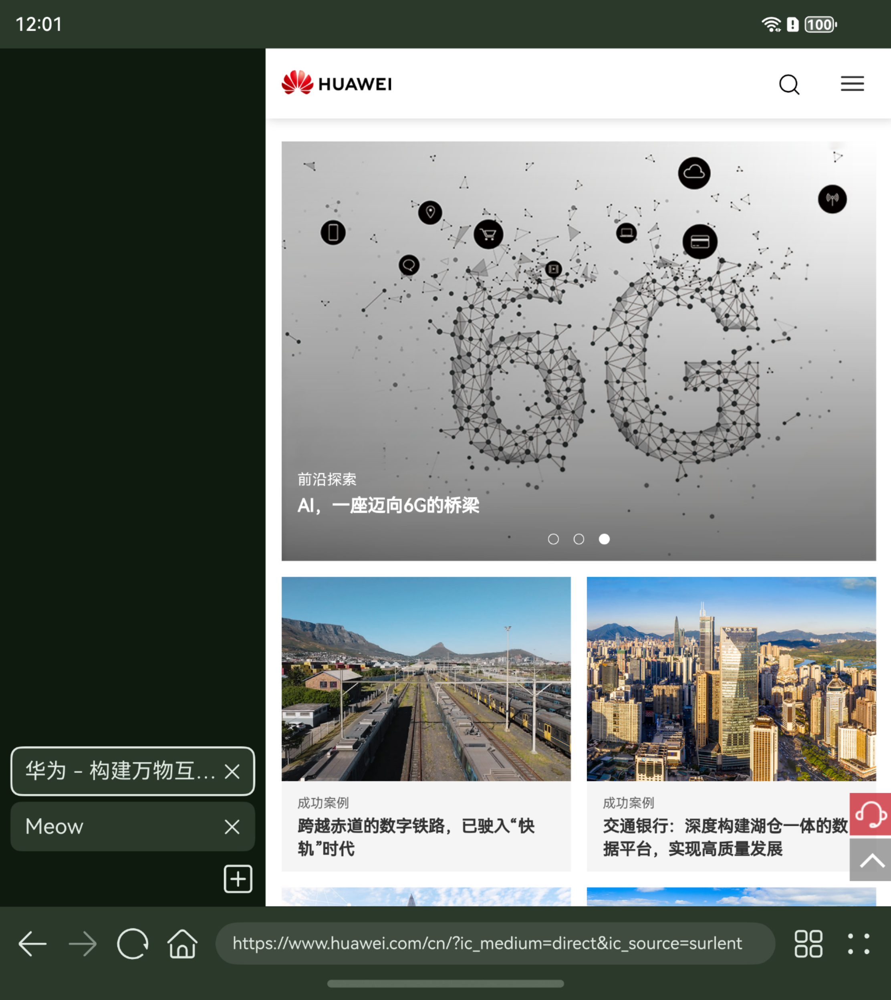
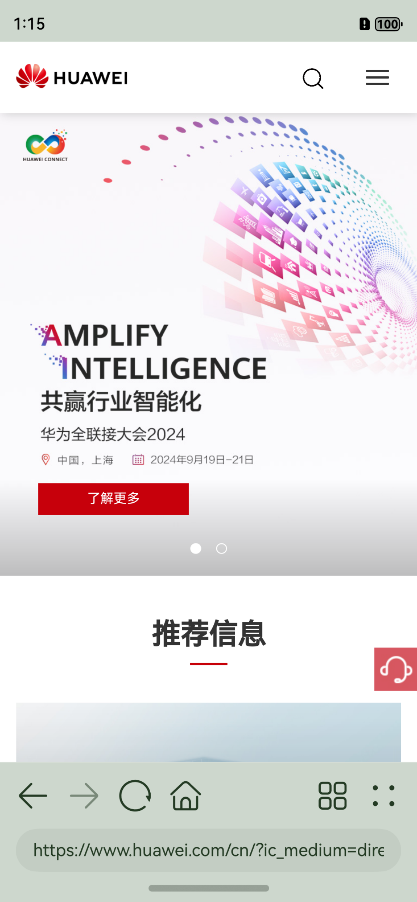
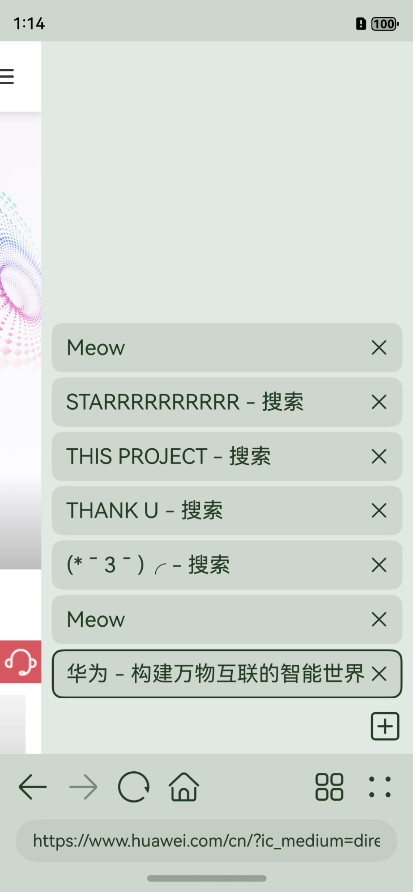

# Liny’s Browser!

[中文](README.md) | [English](README_EN.md)

## Ideas

Liny's Browser is a basic browser built for HarmonyOS NEXT,
aiming in providing a light-weight solution for users
with devices at any performance level.

This project is inspired by
tuyafeng's marvelous work [Via](https://viayoo.com/),
the cutest cyber fox [Firefox](https://firefox.com/) from Mozilla,
and helped by source codes from OpenHarmony's
[Browser Demo](https://gitee.com/openharmony/applications_app_samples/tree/master/code/BasicFeature/Web/Browser)
& Westinyang's fork [Browser CE](https://gitee.com/westinyang/browser-ce).
Thank you all with your works!! (*￣3￣)╭

## Previews

On Large screens (Light Mode):

On Foldables (Dark Mode):

On Phones (Light Mode):

|                  Browsing Page                   |                      TabsView                      |
|:------------------------------------------------:|:--------------------------------------------------:|
|  |  |

## Guides

Type in urls or keywords in the search box at the bottom of the app,
then return or click the little magnifying glass to submit.

Click the icon with four (2x2) little rounded squares to show all tabs,
click again to collapse the panel.

Click the icon with four (2x2) little dots to show page information and more functions,
click again to collapse the panel.

## Related Permissions

[ohos.permission.INTERNET](https://gitee.com/openharmony/docs/blob/master/zh-cn/application-dev/security/permission-list.md#ohospermissioninternet)

## Plans & Developments

May cost unimaginably long time to bring all these into the reality, 
or some of them will even lie on the table for ever... (ง •_•)ง

### Features

- [x] Respond to webpages' request of opening in new tab.
- [ ] Downloads from web.
- [ ] Right click or long press menu on web links. (For preview and operations)
- [x] UA Switching and customizations. (UA related settings)

### Experience

- [x] Customizable position for title bar. (Top or Bottom)
- [ ] Customizable position for Tabs bar. (Side or Top)
- [ ] Customizable themes. (Colors)

## Constraints and limits

Long way ahead.

1. Perhaps due to performance issues on Windows x86-64 Emulators,
   quickly opening plenty of new tabs may cause crashes due to error
   17100001 (Init error. The WebviewController must be associated with a Web component).
   (Seems to be solved, still under observation)
2. Quickly closing plenty of tabs may cause tabs to disappear.
   This is because in some extreme occasions,
   the tab button is trying to close the last+1 index of the tab list.
   An if statement has been added before the operation
   in order to make sure the index is in the legal range.
   (Seems to be solved, still under observation)
3. HarmonyOS UA can't be understood by plenty of websites.
4. The vertical tabs panel animations may seem weird when the scroll is longer than the screen.
5. This project requires HarmonyOS NEXT API12 to run.