# BENCHMARKS

All followings are tested on May 30 2026 using the latest versions available from AppGallery of the contestants at the moment.

Environment: MateBook Fold with Kirin X90 SoC, HarmonyOS 6.1.0.117 (SP68C00E100R12P2), screen unfolded, battery full, plugged in, with external fans assisting to enhance cooling.

App versions: 
1. BrowserCat: First beta of 2.0.0, see [Release of 2.0.0-beta](https://github.com/awaLiny2333/LinysBrowser_NEXT/releases/tag/v2.0.0).
2. Browser J: 2.4.0
3. Browser B: 6.1.4.321
4. Browser H: 2.0.17
5. Browser S: 1.3.0
6. Browser A: 2.3

App settings: Full screen, no other tabs opened, no other Apps running in operating system background.

## Launch and Restore Speed

Tests were performed once, no retesting, subject to randomness — for reference only.

https://github.com/user-attachments/assets/5a28a207-2632-4bc3-8378-8f1553274ead

## Web Permissions / API Compatibility

https://permission.site/

### BrowserCat 2.0

*Note that after clicking Popup, a new page is in fact loaded in a new tab, but the button is red.*

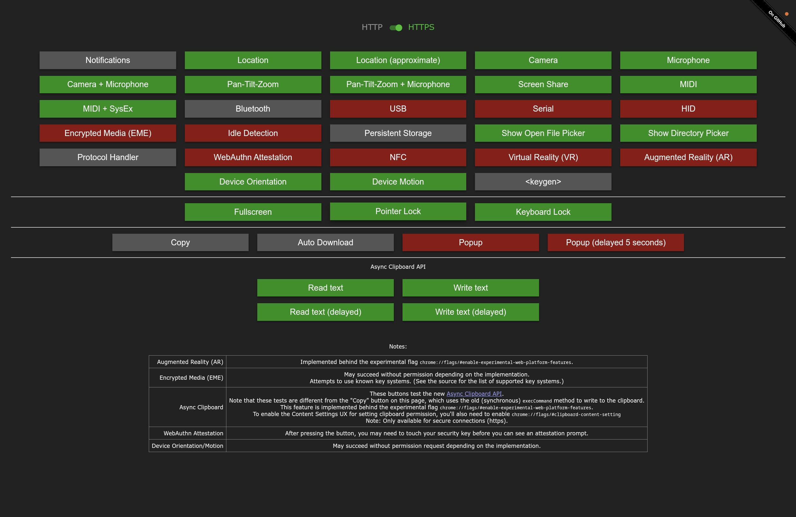

### Browser J

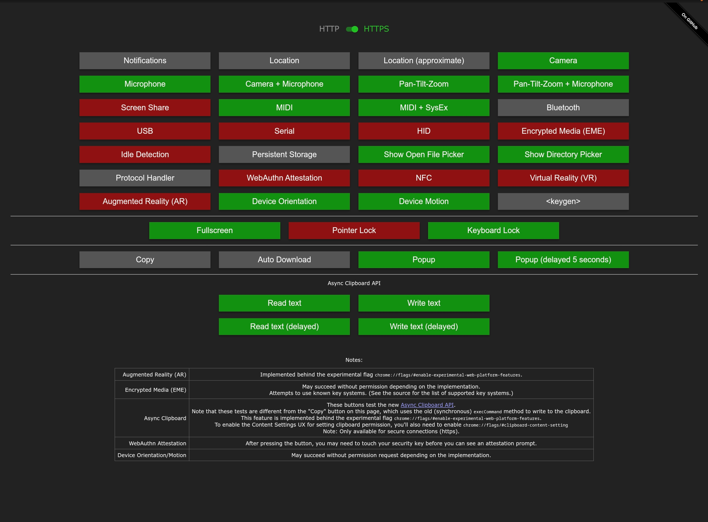

### Browser B

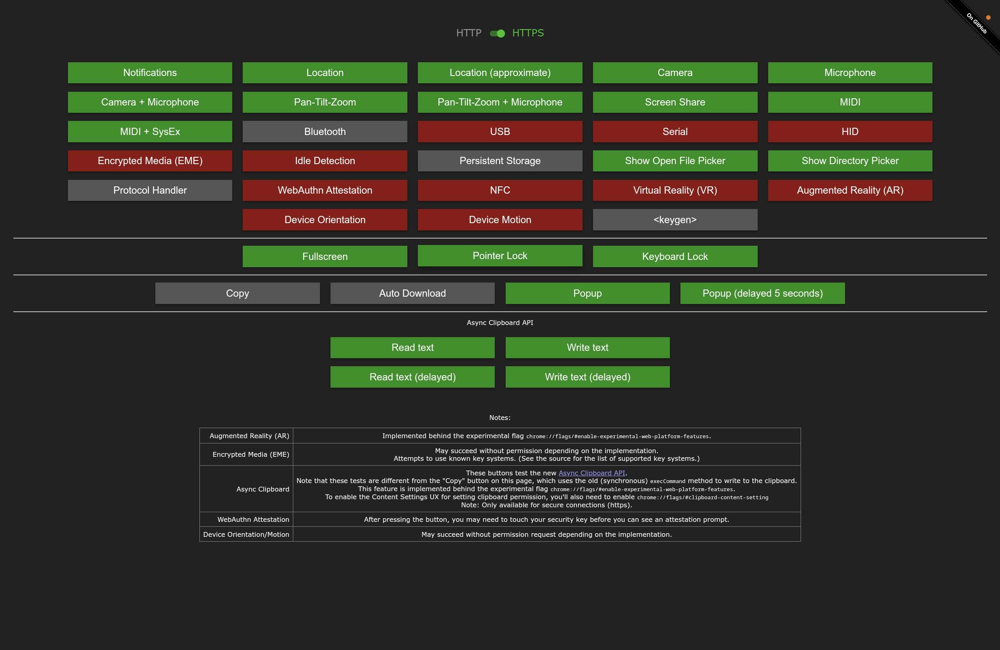

### Browser H

*Note that the Bluetooth, USB, Serial and HID buttons did led to correct prompts of device selection, but no device was available during the test.*

*Therefore, even though those buttons are red (as no device were selected) the corresponding APIs did function correctly as expected.*

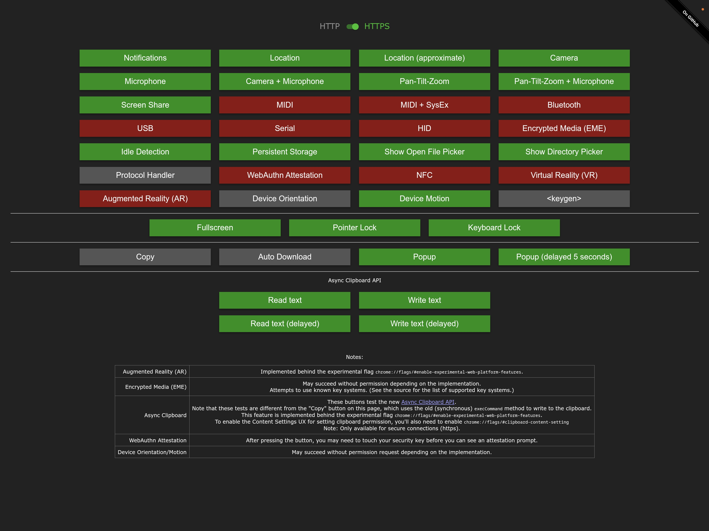

### Browser S

*Note that pressing Popup in fact loaded the entire page as a new page and replaces the original page.*

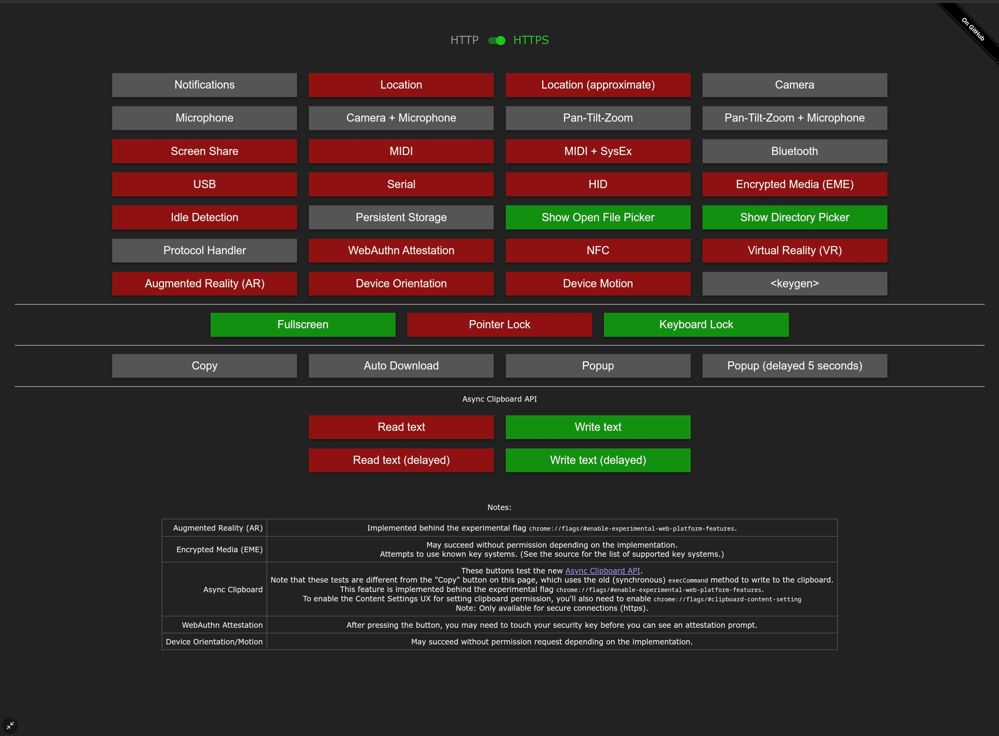

### Browser A

*Note that after clicking Popup, a new page is in fact loaded in a new tab, but the button is red.*

*In addition, colors of buttons could not be correctly shown after switching to Dark mode.*

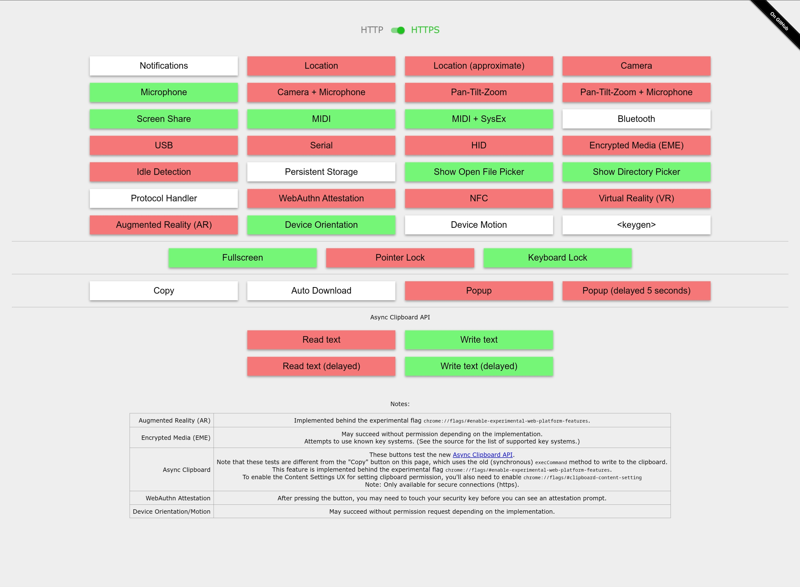

## Performance

https://browserbench.org/Speedometer3.1/

### BrowserCat 2.0

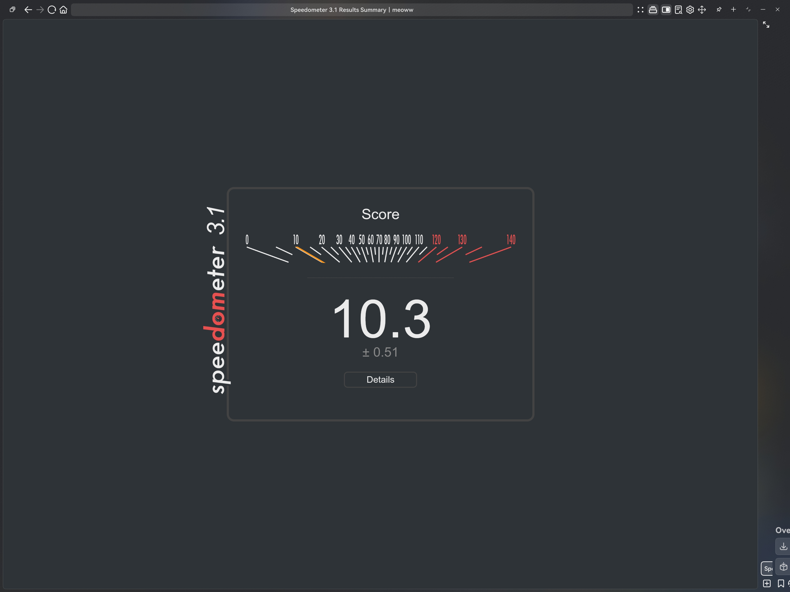

### Browser J

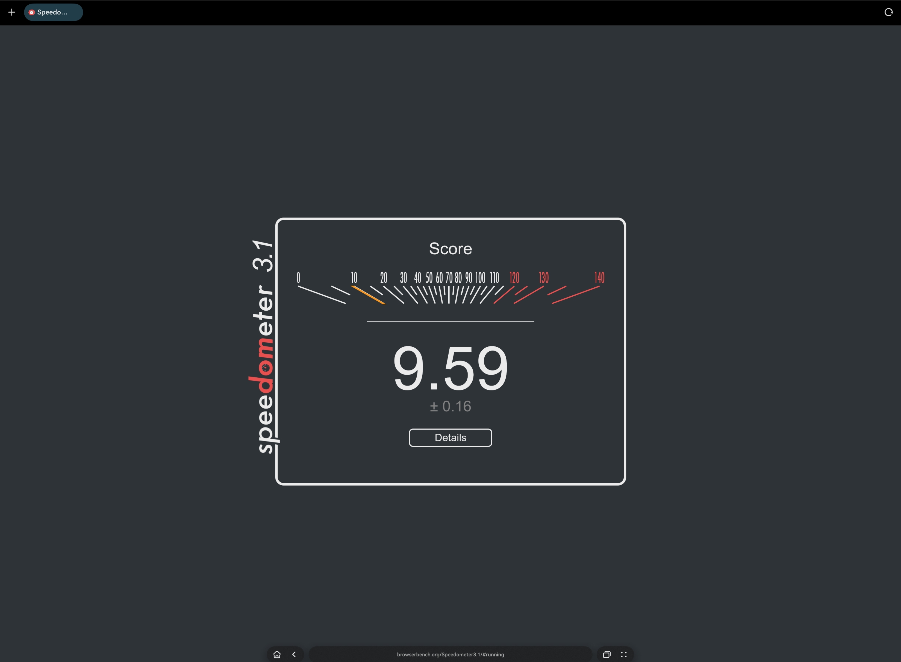

### Browser B

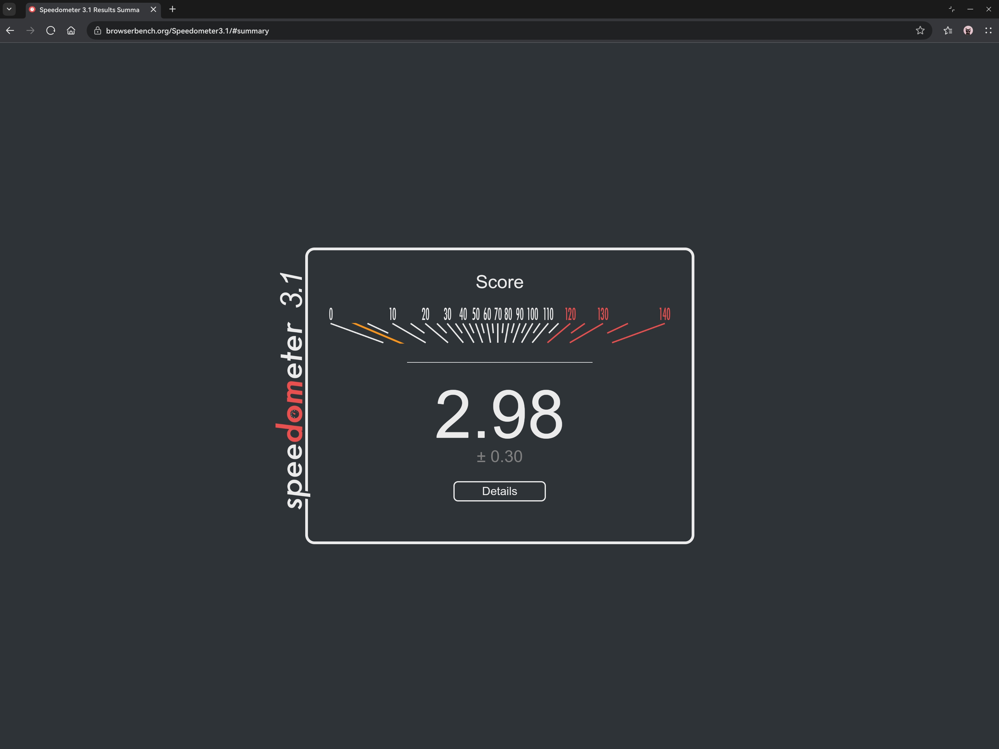

### Browser H

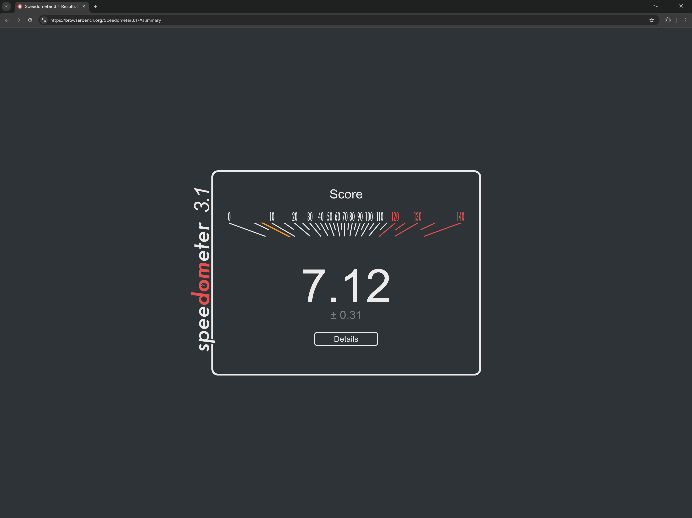

### Browser S

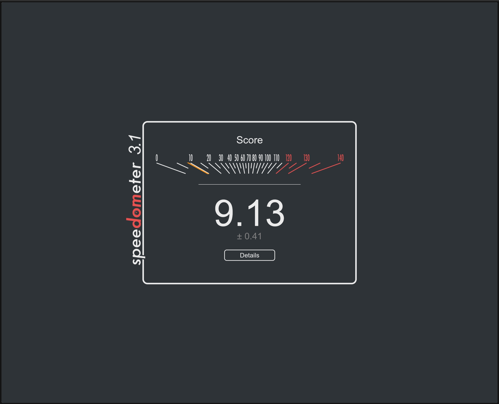

### Browser A

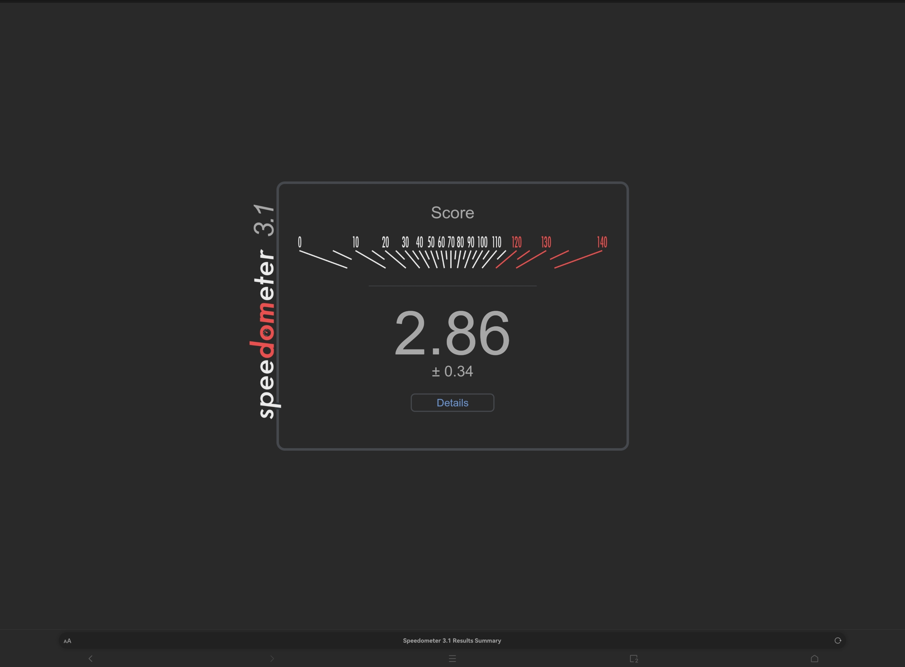
